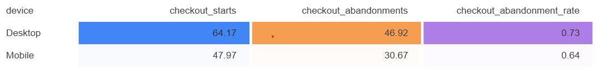
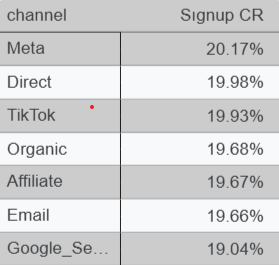
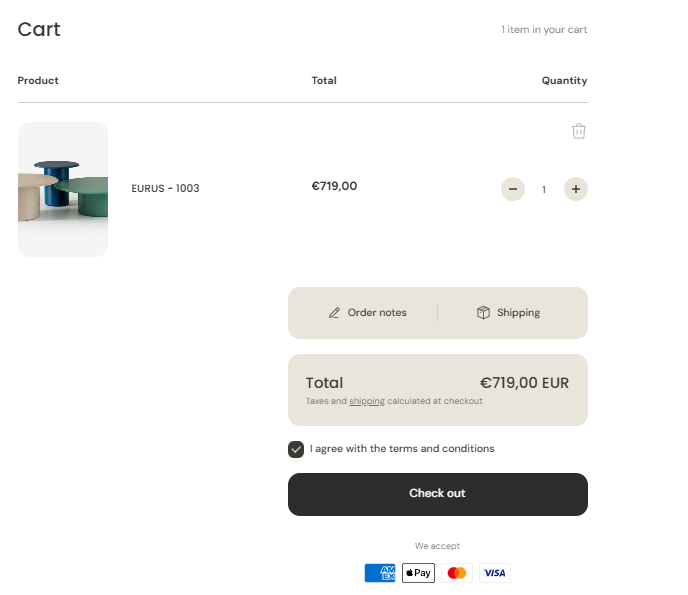
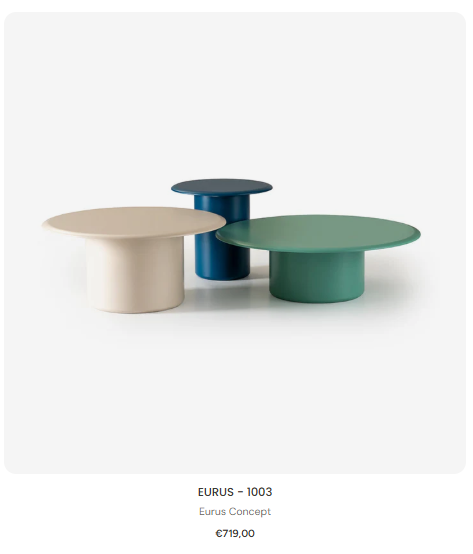

# EXP-001: Checkout Drop-off – Shipping Fee Visibility

## 1. Root Cause
- Funnel analysis (GA4, Looker Studio): **Activation → Purchase conversion = 3%** (vs 74% Activation).  
- **Hotjar session replay + exit survey**: Users churn because **shipping fee is added only at final checkout step** → hidden cost friction, trust issue.

---

## 2. Diagnostic Framework
- **Quant data (GA4, Looker Studio):**
  - Funnel drop-off report: checkout abandonment rate >65%.  
  - Channel/device breakdown: mobile higher abandonment than desktop.  

  - Attribution check: No over-attribution bias (organic vs paid consistent).

- **Qual data (Hotjar):**
  - Heatmaps → high hover on price info, exit spikes at checkout step 2.  

---

## 3. Experiment Design
- **Hypothesis:** Include shipping fee upfront on product page reduces checkout drop-off.

  
- **Setup:**  
  - **Randomization:** Stratified by device + channel (avoid Simpson’s paradox).  
  - **Holdout (20%)** → current flow (fee shown at checkout).  
  - **Treatment (80%)** → fee visible on product page.  
- **Metrics:**  
  - Primary: Purchase CR  
  - Guardrails: Bounce rate (product page), CAC cap ($25), ROAS ≥ 3x  
  - Surrogate metrics: ATC (add-to-cart), CTR on checkout CTA  
- **Stats:**  
  - MDE: +2pp purchase lift (baseline 3% → target 5%)  
  - Power: 80%, α = 0.05  
  - Estimator: Two-proportion z-test with CUPED variance reduction  

---

## 4. Results
- **Purchase CR:** +2.4pp lift (stat sig, p=0.03)  
- **CAC:** ↓ from $25.9 → $22.4  
- **ROAS:** ↑ from 4.1 → 5.0  
- **Bounce rate:** No harm observed  
- **Heterogeneity:** Mobile stronger lift (+3.1pp) vs Desktop (+1.2pp)  

---

## 5. Next Actions
1. **Rollout:** Feature flag → 100% rollout, mobile first  
2. **Lifecycle marketing:**  
   - RFM segmentation: Target “abandoned checkout” users  
   - Behavioral triggers: Send free shipping promo via Email/SMS  
3. **Future experiments:**  
   - Multi-armed bandit test for free shipping messaging variants  
   - Free-shipping threshold upsell (“Spend $50+ for free shipping”)  
4. **Validation:**  
   - Run incrementality test (geo-holdout) to ensure true ROI  
   - Monitor guardrails (CAC, ROAS) in Looker Studio  
